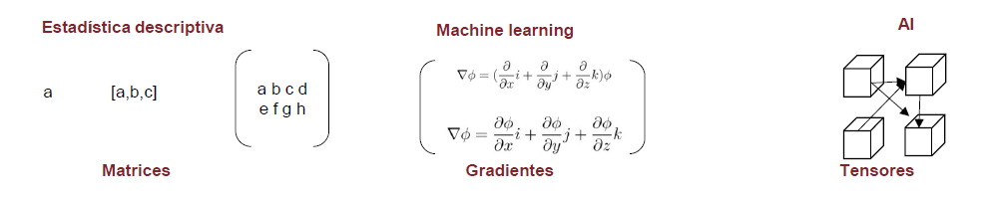

# Datos 

## Qué son los datos

Los **datos están en boca de todos**, “la nueva revolución industrial”, “el nuevo petróleo”, "el nuevo plutonio",… pero ¿qué son los datos? Si nos dirigimos al diccionario de la Real Academia tenemos:

>1. m. Información sobre algo concreto que permite su conocimiento exacto o sirve para deducir las consecuencias  derivadas de un hecho. A este problema le faltan datos numéricos.
2. m. Documento, testimonio, fundamento.
3. m. Inform. Información dispuesta de manera adecuada para su tratamiento por una computadora.
Base de datos: Conjunto de datos organizado de tal modo que permita obtener con rapidez diversos tipos de información.

Parece que la tercera acepción es la correcta pero **los datos no son información**, nos van a permitir obtener información, ésta se obtiene mediante un **análisis estadístico**. Disponer datos de forma organizada no es información. Es la estadística a través de un análisis descriptivo, a través de un modelo o a través de un algoritmo la que obtiene la información. Un científico de datos es un gestor, coge datos y los transforma en información a través de análisis estadísticos más o menos complejos. 

## Tipos de datos

El científico de datos accederá a datos informatizados y, atendiendo a su origen, una posible clasificación sería:

### Datos internos

Son los datos que recoge la propia organización fruto de su actividad, ejemplos en esta línea son:

- Información sociodemográfica
- Información sobre la operativa del cliente
- Contratos activos (y no activos)
- Contactos con el cliente
- Encuestas
- Datos de la red comercial
- …

La lista es larga y depende del tipo de actividad realizada. En este ámbito se está mejorando con la inclusión de sistemas informacionales y  la puesta en valor del uso de los datos, en este sentido es necesario señalar la importancia que toman en las organizaciones los equipos humanos de Tecnologías de la Información. Los datos internos pueden estar organizados o no pero son propiedad de la organización que pretende explotarlos. 


### Datos externos: 

Datos libres o generados por empresas especializadas y que pueden mejorar los análisis estadísticos. Ejemplos:

- Datos GIS de un instituto geográfico
- Análisis de competencia (promociones, puntos de venta, …)
- Estadísticas del INE, Registro de la Propiedad o BOE. Cualquier estadística que publique un estado o una organización de estados
- Bureaux de crédito
- BBDD externas
- …

Este tipo de datos está tomando más peso y aparecen expresiones como _escrapear_ (del inglés scrapping) nos permite obtener datos de sitios web, un ejemplo de fuente de información son las RRSS. Por ejemplo, ¿tendría el mismo precio de un seguro de motos aquel cliente que pone en Instagram fotos de paisajes en sus rutas en moto o aquel cliente que publica acrobacias en su historia?

## Almacenamiento de datos

Es un tema complejo pero el científico de datos debe conocer los entornos que suministran datos y de ese modo hacer un mejor aprovechamiento de ellos. Una visión sintetizada y simplista sería. 

### Sistemas operacionales

Son los sistemas con los que se gestiona una organización y con los que trabajan aquellos que, en muchas ocasiones, no les preocupa lo más mínimo la ciencia de datos. Aquí existen sistemas como mainframes, AS400 o CRMs, estos sistemas tienen información exhaustiva sobre operaciones y sobre la actividad, pero esa información no está (estaba) pensada para explotarse, muchos carecen de visión cliente y están más orientados a productos y a la propia actividad empresarial. Pueden suministrar información en tiempo real pero el modo en el que se almacenan estos datos puede dificultar su explotación estadística. 

### Sistemas informacionales tradicionales

Al albor de la importancia de los datos nacieron los primeros sistemas informacionales como el data warehouse, lo principal en ellos es la estructura y la distinción entre productos, contratos y clientes. Estos sistemas empiezan a tener campos, variables, pensadas para su explotación estadística y la modelización. Además, toma relevancia la tabulación de los datos con una visión histórica. Estos sistemas informacionales son caros, requieren recursos para su actualización y provienen de procesos intermedios que, en ocasiones, no recogen toda la problemática del operacional pero gracias a ellos las organizaciones han empezado a conocer la importancia de gestionar los datos, la importancia de la **inteligencia de negocio**, el _bussines intelligence_. 

### Data Lake

Es el 'nuevo' paradigma al amparo de la aparición de equipos informáticos más potentes, se accede de un modo muy rápido, permite disponer de un gran volumen sin estructura por lo que la información puede ser muy exhaustiva, es más complejo distinguir la visión cliente y esa falta de estructura hace que el acceso a estos sistemas requiera de software y hardware específico además de equipos humanos más especializados. No están pensados para el análisis estadístico tradicional pero es factible. Hay una menor integridad en la información disponible pero se puede acceder y explotar un volumen de información que antes era más complicado por lo que se abren nuevas formas de explotación estadística de datos. 

En este trabajo no se va a trabajar con el acceso a estos sistemas, la información vendrá tabulada directamente pero es necesario reiterar **el científico de datos tiene que tener claro donde están los datos y como acceder a ellos**. 

## Todo es álgebra lineal

Esta figura es clave y aparecerá en más ocasiones para señalar la importancia de las estructuras algebraicas en el análisis y la modelización estadística. 



Es relevante disponer de ese conocimiento matemático porque **todo el trabajo que realiza el científico de datos es algebra lineal**, menos el trabajo administrativo el resto es álgebra. De hecho, la ciencia de datos ha evolucionado a la vez que los equipos informáticos han podido manejar estructuras algebraicas más complejas. La estructura más sencilla podría ser un número o una sucesión de números que forma un vector, para analizar vectores haríamos **estadística univariable**. Si tenemos varias variables y ponemos esos vectores en forma matricial ya estamos en disposición de ver muchas variables a la vez. Si a esas **matrices** le añadimos funciones que puedan ser derivadas podremos sintetizar su información mediante **gradientes** y por último si añadimos más dimensiones y complejidad a estas estructuras estamos ante **tensores matemáticos**. Visto como una secuencia:

- Vectores -> análisis univariable como tablas de frecuencia, sumarización estadística o gráficos, al trabajo con estructuras vectoriales se le puede denominar **business intelligence**.

- Matrices -> análisis multivariable como modelos lineales, componentes principales,.. cuando se trabaja con cálculo matricial estamos haciendo **modelización estadística**.

- Gradientes -> análisis multivariable basado en modelos de aprendizaje automático, tenemos funciones multivariables que nos permiten derivar matrices de forma parcial para buscar máximos y mínimos locales, permiten realizar modelos de **machine learning**.

- Tensores matemáticos -> aprendizaje profundo con redes neuronales que imitan el comportamiento humano, **inteligencia artificial**.

Es evidente el paralelismo entre la evolución matemática y la evolución informática. Mayor capacidad de computación ha implicado poder manejar estructuras algebraicas más complejas y esto ha permitido una evolución en el análisis estadístico. 


## Como se disponen los datos

Para poder llevar a cabo un análisis estadístico los datos no sólo han de estar disponibles, además deben de tener una lógica y una estructura para ser utilizados. Habitualmente, los datos estarán dispuestos en **tablas** donde, de forma horizontal, tenemos registros y de forma vertical tenemos columnas. Existen diversas "dialécticas" en ciencia de datos para hacer referencia a esas columnas y a esos registros, en general dependerá del software que empleemos en nuestro trabajo. En este ensayo se va a emplear **R** y la librería `tidyverse` de este modo la estructura de datos principal será el **data frame**. 

```{r message=FALSE, warning=FALSE}
library(tidyverse)

data("iris")
str(iris)
head(iris, 5)
```


La función `str` nos permite describir las características de un objeto de R, en este caso se trata de un data frame donde cada fila será un registro, una observación, que podrá ser un individuo, un contrato, una compañía, una especie de flor, un pingüino,... depende de la **población** que esté en estudio. De esa población se pueden extraer subconjuntos de registros que llamaremos **muestras** que deberían ser representativos de la población y permitirían, con menos medios, estudiar los problemas que deseamos analizar en la población. Esta muestra permitiría **inferir** aspectos de interés en la población. 

Cada columna del data frame será denominada **variable** que define una característica de la observación, esta característica puede ser cualitativa (factor) o cuantitativa (número). El estudio de esas características será el que nos lleve a describir o estimar el problema al que nos enfrentamos.

## Tipos de Variables

Cuando se afrontan proyectos de ciencia de datos la mejor solución es dividir las variables en cualidades o cantidades, con sus matices. 

### Variables cuantitativas

Son numéricas y pueden tener un número muy grande (en algunos casos infinito) de valores y describen una cantidad numéricamente. En sucesivos capítulos se verá que estas variables serán descritas con estadísticos descriptivos, en análisis visuales se emplearán histogramas, gráficos de densidades o gráficos de cajas (boxplot). 

Los problemas que plantean estas variables son:

  - Aparición de valores modales que desvirtúan la forma o la distribución de los valores como por ejemplo el valor 0 en una variable que recoja  saldo en fondos de inversión, ¿eliminamos una variable porque el 80% de las veces toma un valor 0? 
  
  - Valores atípicos o _outlier_ también pueden desvirtuar los análisis estadísticos. Si una observación tiene una variable numérica que toma un valor anormalmente alto o bajo, ¿debemos incluirla en el análisis?
  
  - Valores perdidos o valores missing en las variables cuantitativas supone un problema, debemos tener clara nuestra estrategia con los valores perdidos antes de analizar la información que nos suministran los datos. ¿Qué hacemos con esas observaciones que no tienen datos para determinadas variables? ¿Tiene sentido que no tengan datos?

### Variables cualitativas. Factores

Toman un número finito (en ocasiones muy extenso) de valores y describen una cualidad. En el conjunto de datos pueden ser tanto numéricas como cadenas de caracteres, da igual el formato pero es necesario saber que representa una cualidad. Esta cualidad puede estar ordenada como puede ser un ranking `bueno/medio/malo` o simplemente describir un valor como es el sexo `Femenino/Masculino`. Siguiendo con la dialéctica de R a estas variables las vamos a denominar **factores** y a cada valor que pueda tomar el factor le denominamos **nivel**. Para describir estas variables emplearemos tablas de frecuencia donde se pueden contar el total de observaciones para cada nivel del factor o bien relativizar esas cantidades y calcular frecuencias como porcentajes sobre el total de observaciones. Gráficamente se sugiere usar gráficos de barras o de tarta que se verán posteriormente.

Los problemas que presentan son análogos a los vistos con las variables cuantitativas:

  - Valores modales, si un factor presenta un nivel con un gran número de observaciones, ¿merece esfuerzo incluir ese factor?
  - Valores missing, si el valor no está disponible ¿podemos crear otro nivel que sea N/D?
  - Gran número de niveles de un factor. En ocasiones tendremos factores con miles de niveles como un código postal, es evidente que tenemos que agrupar los niveles de un factor, ¿qué estrategias de agrupamiento podemos seguir?

## El rol de las variables en los datos

Una vez es conocido el como se estructuran los datos y como se puede aproximar a ellos el científico de datos es necesario remarcar que las variables no tienen todas el mismo rol, en un conjunto de datos cada variable juega un papel distinto. Hay variables que identifican registros, hay fechas, medidas, campos calculados, factores reclasificados... Se tiene claro que todas estas variables siempre serán factores o variables cuantitativas, pueden almacenarse como una cadena de caracteres o como un número, pero dentro del conjunto de datos hay que tener muy claro que función desempeñan. 

Una clasificación global del rol de las variables en los datos es:

* **Variable Target**: Es la variable más importante porque describe el objetivo sobre el que realizamos el análisis. Es la variable encargada de dar respuesta al problema que planteamos a los datos. 

* Variable input: Esta variable servirá para "explicar" el comportamiento de nuestra variable target. 

* ID: las observaciones suelen ir identificados por un campo del conjunto de datos. Puede ser un DNI, un número de contrato, una codificación administrativa,... 

* Raw (variable en bruto): serán las variables que nos ayudarán a crear cualquiera de los tipos anteriores. Por ejemplo, una fecha en sí misma no debe ser un dato de entrada en un modelo de clasificación, ha de ser transformada para crear una variable objetivo o bien una variable input que nos ayude a predecir o explicar nuestro el comportamiento de la variable target.

En determinados análisis el científico de datos no dispone de esa variable target que dirige el análisis. La disponibilidad de la variable target también define el tipo de análisis estadístico a plantear. Durante todo este ensayo se van a emplear ejemplos con variable target definida, todos los análisis estadísticos serán dirigidos. 

