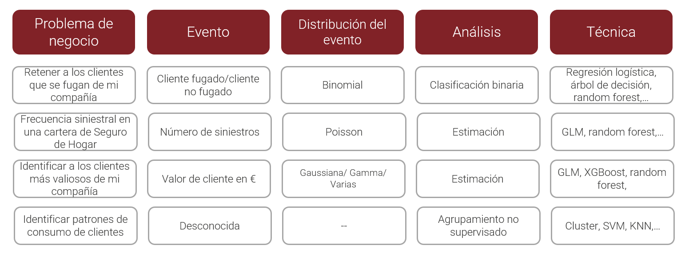

# Modelos GLM. Regresión logística y regresión de poisson {#modelos-GLM}

## Motivación de los modelos GLM

Hasta el momento se han planteado los siguientes modelos.

- Modelo de regresión lineal
- Modelos factoriales en diseño de experimentos

Para ambos modelos la variable respuesta ha de ser cuantitativa y distribuida normalmente, pero en el capítulo 10 se vio la siguiente figura. 



La respuesta normal o gaussiana aparece, pero existen otro tipo de situaciones a las que se enfrenta el científico de datos donde **el evento a estudiar no se distribuye normalmente**. Sin ir mas lejos, en el ejercicio que está sirviendo de hilo conductor en el ensayo, una aseguradora española que opera en múltiples ramos quiere ofrecer seguro de automóviles a sus clientes del ramo de salud. Para ello se realizó un cuestionario a los clientes de forma que se marcó quienes de ellos estarían interesados en el producto de automóviles y quienes no. La variable de interés es si o no lo que plantea una clasificación binomial. **¿Qué sucede si se modeliza eventos si/no mediante un modelo de regresión lineal?** Siguiendo el propio ejemplo de trabajo al que se hace permanentemente referencia. 


```{r message=FALSE, warning=FALSE}
library(tidyverse)
library(DT)

train <- read.csv("./data/train.csv")
datatable(head(train,5))
```


Código conocido para importar los datos y mostrar la cabecera de los mismos, a continuación se realiza un modelo de regresión lineal sobre una muestra aleatoria del conjunto de datos de partida de 1000 observaciones donde la variable `Response` se pone en función de la prima anual `Annual_Premium`.

```{r}
set.seed(0)
muestra <- train %>% sample_n(1000)
modelo.prueba <- lm(muestra$Response ~ muestra$Annual_Premium)
```

Se grafica el resultado del modelo tras la realización del scoring sobre el propio conjunto de datos empleado para realizar el modelo.  

```{r}
muestra$prediccion <- predict(modelo.prueba, muestra)

muestra %>% ggplot(aes(x=Annual_Premium, y=Response)) + geom_point() + 
  geom_line(aes(x=Annual_Premium,prediccion), color="#E30606")

```

Se puede observar que una recta de regresión no tiene mucho sentido, es una recta que está entre el 0 y el 1, no sirve este modelo para modelizar una variable que toma valores de esta forma. Un paso más allá, llevando este caso al extremo se modeliza una función de probabilidad de un evento de la forma $P(x) = \frac{1}{1 + exp(f(x))}$

```{r}
# Observaciones
num = 1000
x = rnorm(num)
```

La variable independiente x se distribuye normalmente. Ahora se calcula una probabilidad con la función de probabilidad antes citada para $f(x)=-5 + 2.5*x$ (por asignar unos parámetros). Esa probabilidad se pasa a valores 0 y 1 mediante una generación de números aleatorios de una binomial.

```{r}
p=1/(1+exp(-(-5 + 2.5*x)))
# Generación de 0/1 aleatorios en función de p
y=rbinom(num,1,p)
datos_binomial = data.frame(cbind(x,y))
```

En este punto se dispone de un conjunto de datos donde la variable dependiente es una distribución binomial función de una variable independiente que se distribuye normalmente. Se insiste en la importancia de generar este tipo de variables no solo para entender como se comportan funciones, también es útil para crear sistemas complejos. Con el conjunto de datos generado artificialmente se realiza un modelo. 

```{r}
modelo.prueba2 <- lm(data=datos_binomial, y~x)

prediccion <- data.frame(x=datos_binomial$x, y = predict(modelo.prueba2, datos_binomial))
                                                         
ggplot(data=datos_binomial, aes(x=x, y=y)) + geom_point() + 
  geom_line(data = prediccion, aes(x=x, y=y), color="red") + 
  labs(title = "Regresión lineal sobre datos binomiales")
```

En este caso el modelo de regresión lineal puede obtener números inferiores a 0 que no tienen sentido, es claro que a medida que aumenta x aumenta la probabilidad de y = 1. Además,como se señaló en la figura con la que se iniciaba el capítulo los problemas a los que se enfrenta un científico de datos no son solamente clasificaciones binomiales, pueden seguir una distribución de Poisson si se están contando elementos en un espacio de tiempo o una distribución Gamma si se están modelizando importes (por ejemplo). En estas situaciones los modelos lineales tal y como se han trabajado hasta el momento no sirven. Es necesario añadir algún elemento, alguna **transformación o función** que permita emplear modelos lineales con este tipo de distribuciones y por ello aparecen los **Modelos Lineales Generalizados** GLM por sus siglas en ingles. Son modelos lineales que permiten que la variable dependiente no tenga cambios aditivos, es decir, que la variable dependiente no se distribuya normalmente.  

## La función de enlace en los modelos GLM

Como en todo modelo estadístico se tiene una componente aleatoria que hay predecir/explicar que ahora no se distribuye normalmente y se dispone de otro componente que, sistemáticamente, **predice/describe** esa componente aleatoria. Los GLM añaden al modelo lineal una función de enlace a los datos que nos permite relacionar los modelos lineales con otro tipo de distribuciones mediante una función de la media. Para entender mejor en que consiste la función de enlace hay que volver al modelo lineal donde se indicaba que era una variación aditiva de medias por lo que su función de enlace es la propia media. En una distribución binomial la media es una proporción $p$ pero se ve en el ejemplo anterior que el modelo no arroja el dato esperado, sin embargo, si se modeliza $log(\frac{p}{1-p})$ para esos datos artificiales creados con anterioridad ¿qué sucede?

```{r}
modelo.prueba2 <- lm(data=datos_binomial, log(p/(1-p))~x)
summary(modelo.prueba2)

prediccion <- data.frame(x=datos_binomial$x, y = predict(modelo.prueba2, datos_binomial))
```

Se crea un modelo perfecto (así lo advierte R) con los parámetros y la función que han generado los datos. En este punto se recuerda la necesidad de deshacer la transformación sobre la variable dependiente, asunto tratado en el tema referente a la regresión lineal. 

```{r}

prediccion$y <- exp(prediccion$y)/(1 + exp(prediccion$y))
                                                         
ggplot(data=datos_binomial, aes(x=x, y=y)) + geom_point() + 
  geom_line(data = prediccion, aes(x=x, y=y), color="red") + 
  labs(title = "Regresión lineal sobre datos binomiales")
```


Esa transformación $log(\frac{p}{1-p})$ ha permitido realizar un modelo lineal "con sentido" porque no se está modelizando el 1/0, se está modelizando la razón de probabilidades $log(\frac{p}{1-p})$ que es conocida como _odds ratio_, una razón que determina cuantas veces más se produce el 1 sobre el 0. Ya que no se puede modelizar cuando toma valor 0 o 1 se modeliza cuanto es más probable tener un 1 sobre un 0. Esa es la transformación llevada a cabo, es la función que enlaza el modelo lineal con la clasificación binomial. En el caso concreto de la regresión logística esta será la **función de enlace** que permite emplear un modelo lineal. 

Las funciones de enlace más empleadas son:

- Normal: $X\beta = E[Y]$ la media
- Binomial: $X\beta = log(\frac{p}{1-p})$ función logística
- Poisson: $X\beta = log(E[Y])$ función logarítmica
- Gamma: $X\beta = \frac{1}{E[Y]}$ función recíproca

Para los GLM el método de estimación de los parámetros más adecuado no son los mínimos cuadrados y por ello se emplea la **estimación por máxima verosimilitud** que conceptualmente es parecida a la estimación de parámetros que se trató en el tema 12. Conocida la distribución y a partir de los datos disponibles, se busca el parámetro más verosímil. Existen distintos algoritmos capaces de encontrar estos parámetros. Si se desea profundizar más en aspectos teóricos sobre la estimación de los parámetros por este método se recomienda <a href="https://tereom.github.io/fundamentos/S-max-verosimilitud.html" target="_blank">leer este enlace</a>.

## Regresión logística

La regresión logística permite hacer clasificación binomial problema al que el científico de datos se enfrentará en múltiples ocasiones. En el ejemplo de trabajo se plantea un modelo de clasificación binomial que permita identificar que clientes son más propensos a contratar un seguro de automóviles dentro de la cartera de seguros de salud, lo que se conoce como un **modelo de venta cruzada**, habituales dentro del mundo del marketing analítico. En este caso una regresión logística se adecua a las necesidades del análisis.  

Para entender como trabaja una regresión logística se realiza un modelo sencillo con una sola variable, con los datos de trabajo se realiza un modelo únicamente con la variable `Age`.

```{r}
modelo.prueba3 <- glm(data=train, formula=Response ~ Age, family = binomial)
```

El código es completamente análogo al visto en los modelos de regresión lineal pero se emplea la función `glm` y es necesario indicar la función de enlace que en este caso es la que viene de la familia binomial. Sumarizando el modelo se tiene:

```{r}
summary(modelo.prueba3)
```
La salida que ofrece es parecida a las ya trabajadas, lo primero es estudiar los parámetros y se aprecia que la variable es significativa aunque el valor del parámetro es próximo a 0 el test de parámetros se interpreta exactamente igual que en la regresión lineal. En este caso no aparece el $R^2$ y si aparece el AIC (Akaike information criterion) que es una medida de lo bueno que es el modelo pero al contrario que el $R^2$ no se va a establecer un valor de referencia, el modelo será mejor cuanto menor sea el AIC. Para estudiar como estima el modelo se retoma la función `bivariable` vista en el capítulo 11.

```{r}
bivariable <- function(df, target, varib, ajuste=1){
  
target = as.symbol(target)
fr_analisis = as.symbol(varib)

g <- df %>%
   group_by(factor_analisis = as.factor(!!fr_analisis)) %>%
   summarise(pct_clientes = round(n()*100/nrow(df),1),
           pct_interesados = round(sum(!!target)*100/n(),1), .groups='drop') %>% 
   ggplot(aes(x=factor_analisis)) +
   geom_line(aes(y=pct_interesados * ajuste), group=1, color="red") +
   geom_col(aes(y=pct_clientes),fill="yellow",alpha=0.5)  +
   geom_text(size=3, aes(y=pct_interesados * ajuste, label = paste(pct_interesados,' %')), color="red") +
   scale_y_continuous(sec.axis = sec_axis(~./ajuste, name="% interesados"), name='% clientes') +
   theme_light()
 
g + labs(title = paste0("Análisis de la variable ",varib))
}

bivariable_Age <- bivariable(train, 'Response', 'Age', 0.5)
```

Código ya conocido que genera un gráfico de análisis bivariable. Sobre este análisis se va a presentar la estimación del modelo. Se necesita cierto trabajo para poder llevar a cabo la representación gráfica
. 

```{r}
edades <- seq(min(train$Age),max(train$Age))
edades <- data.frame(Age=edades)
edades$estimacion <- predict(modelo.prueba3, newdata=edades, type='response')
datatable(edades)
```

Un paréntesis antes de graficar los resultados, se realiza la estimación para las posibles edades del conjunto de datos, del mínimo al máximo. Se emplea la función `predict` donde el nuevo conjunto de datos es ese posible rango de edades y es necesario especificar que se requiere la respuesta `response` ofrecida por el modelo. Es lo que permite realizar el gráfico, ahora se representa esa estimación sobre el análisis bivariable visto en el capítulo 11 del ensayo.


```{r}
bivariable_Age + geom_line(aes(y=edades$estimacion*50), group=1, color="blue")
```


Recordar las particularidades de ggplot con los gráficos de dos ejes, es necesario transformar los datos en % * 100 pero se ajustaba la salida y por ello hay que multiplicar por 50 en vez de por 100. Se observa que el modelo tiene muchas deficiencias, es creciente, un modelo lineal no puede recoger esa forma que presenta la variable dependiente en función de `Age` ya que hay un comportamiento que claramente no es lineal. Sin embargo, si se considera la edad como un factor y se realiza el modelo:

```{r}
modelo.prueba4<- glm(data=train, formula=Response ~ as.factor(Age), family = binomial)
summary(modelo.prueba4)
```

Cada edad tiene un parámetro asociado y se puede apreciar que casi todos son significativos a excepción de las edades más avanzadas donde los parámetros no superan el test $\beta_i=0$, curiosamente en el capítulo 12 cuando se trataron los intervalos de confianza en esos mismos rangos de edad se obtenían unos intervalos muy amplios para la media y se llegó a la conclusión de que el número de clientes en edades avanzadas es susceptible de ser agrupado. De nuevo un tema visto con anterioridad puede resultar útil para mejorar el proceso de modelización. 

Volviendo con los parámetros, para transformar los modelos en probabilidad se tenía la siguiente función:

$$\hat{p}(Y=1|X)=\frac{exp({\hat{\beta_0}+\hat{\beta_1}X})}{1+exp({\hat{\beta_0}+\hat{\beta_1}X})}$$

Anteriormente se justificó por ser la transformación de la función de enlace. Para la edad más baja se tiene la siguiente estimación:

$$\hat{p}(Y=1|X)=\frac{exp({-3.56797})} {1 + exp({-3.56797})}$$

Se recuerda que **no aparece el parámetro** para `Age`=20 porque no es necesario, es el $\beta_0$, el nivel base y el resultado es `r exp(-3.56797)/(1+exp(-3.56797))`, para `Age`=21 se tendría:

$$\hat{p}(Y=1|X)=\frac{exp({-3.56797+0.24759})} {1 + exp({-3.56797+0.24759})}$$

Con resultado: 

`r exp(-3.56797+0.24759)/(1+exp(-3.56797+0.24759))` y así para cada una de las edades. ¿Qué está estimando el modelo? Se va a entender con el siguiente código en R donde se une la media con la estimación del modelo.

```{r}
resumen <- train %>% group_by(Age) %>% 
  summarise(porcen_interesados = round(sum(Response)/n(),3))

resumen$prediccion <- round(predict(modelo.prueba4, newdata = resumen, type = "response"),3)

datatable(resumen)
```

Si, el modelo con una sola variable está estimando la media porque es el estimador más verosímil en un modelo de clasificación binomial para una sola variable. La regresión logística está calculando la proporción de 1s para cada factor. Gráficamente.

```{r}
bivariable_Age + geom_line(aes(y=resumen$prediccion*50), group=1, color="blue")
```

**El modelo ajusta perfectamente la proporción de respuestas positivas**, ¿es un buen modelo? Parece que sí, identifica perfectamente los porcentajes de respuestas positivas, esto se ha conseguido con un modelo que tiene un parámetro para cada edad y muchos parámetros implicaban mayor complejidad y esa complejidad está describiendo a la perfección el problema que se planteaba el científico de datos. Ahora bien, ¿el modelo "se ha aprendido" los datos? ¿qué pasaría con otros datos? Cuando un modelo se conoce a la perfección los datos con los que se entrena se comete un **sobreajuste** (overfitting en inglés) o una _sobreparametrización_. Un exceso de complejidad hace que el modelo conozca a la perfección los datos empleados para su entrenamiento. Se torna necesario probar el modelo con otro conjunto de datos y agrupar la variable independiente para identificar la tendencia pero sin ajustarse a la perfección a cada nivel del factor `Age`. En capítulos  posteriores se verá como poder controlar esta sobreparametrización. 

El modelo de regresión logística está ajustando las medias de la proporción a los factores, entonces, si se cruzan factores no será necesario emplear una regresión logística ya que el cruce del múltiples factores daría un resultado muy similar, no exactamente el mismo debido a la estimación por máxima verosimilitud. Por ejemplo con dos factores.

```{r message=FALSE, warning=FALSE}
resumen <- train %>% group_by(Age, Gender) %>% summarise(porcen_interesados=mean(Response))
datatable(resumen)
```

Si se promedian 2 factores se tienen n*m niveles de factores, se complica esa estructura, sin embargo, un modelo con esos dos factores.

```{r}
modelo.prueba5 <- glm(data=train, Response ~ as.factor(Age) + Gender, family=binomial)
df <- data.frame(Age = 22, Gender='Female')
predict(modelo.prueba5, df, type="response")
```

Los parámetros están recogiendo información del promedio de 1's de múltiples variables, en este caso factores. La regresión logística está _microsegmentando_ el porcentaje de clientes interesados en función de las propias características de los clientes por lo que se dispone de una herramienta de clasificación binomial que permite tanto estimar como **describir** el comportamiento de una serie de variables independientes con una sola función matemática. A continuación se introducen más variables en el modelo.

```{r}
modelo <- glm(data = train, Response ~ as.factor(Age) + Gender + Driving_License + 
                as.factor(Region_Code) + as.factor(Previously_Insured) + Vehicle_Age +
                Vehicle_Damage + Annual_Premium + as.factor(Policy_Sales_Channel) + 
                Vintage)

summary(modelo)
```

Esta estructura es de difícil interpretación ya que se disponen de múltiples factores con muchos niveles, es necesario un paso previo de agrupación de niveles que se ha tratado en capítulos anteriores. Hay variables cuantitativas como `Annual_Premium` que pueden tener comportamientos no lineales por lo que podría ser interesante realizar un ejercicio previo de tramificación de esta variable cuantitativa. 

En este proceso de modelización se está poniendo de relieve la importancia de todos los capítulos anteriores ya que se está esbozando la necesidad de seguir una serie de pasos como:

- Describir numéricamente y gráficamente las variables que van a participar en el proceso de modelización
- Determinar que problemas presentan los datos tanto en observaciones como en variables para establecer cuales de ellas van a participar en ese proceso
- Analizar de forma bivariable las variables y las observaciones seleccionadas frente a la variable respuesta
- Muestrear los datos para seleccionar los datos que van a entrenar el modelo y los que van a testear los resultados
- Comenzar a realizar modelos y experimentar con los resultados
- Medir la capacidad predictiva del modelo
- ...

Es decir, es necesario establecer un **método de modelización estadística** que se verá en el siguiente capítulo del ensayo. 

## Regresión de poisson

Otro de los modelos GLM que debe conocer un científico de datos antes de empezar a realizar modelos más complejos es la regresión de poisson. Para ilustrar la regresión de poisson no es posible emplear los datos de trabajo ya que el problema a estudiar, si un cliente se muestra o no interesado, es un prototipo de clasificación binomial y con la regresión de poisson se estiman/describen *número de eventos en un espacio de tiempo*. Por este motivo es necesario seleccionar otros datos para mostrar como trabajan este tipo de modelos generalizados. En este caso, los datos son los empleados en algunos ejercicios del libro "Non-Life Insurance Pricin with GLM" y corresponden a una cartera de motos de una compañía aseguradora. Las variables disponibles son la edad, sexo, zona de circulación, clase de la moto, antigüedad de la moto, bonificación del conductor, exposición en años, número de siniestros y el importe de los mismos. 

```{r, warning=FALSE}
library(tidyverse)
library(DT)

varib <- c(edad = 2L, sexo = 1L, zona = 1L, clase_moto = 1L, antveh = 2L,
             bonus = 1L, exposicion = 8L, nsin = 4L, impsin = 8L)

varib.classes <- c("integer", rep("factor", 3), "integer",
                    "factor", "numeric", rep("integer", 2))

#con <- url("http://staff.math.su.se/esbj/GLMbook/mccase.txt")
con <- "./data/mccase.txt"

moto <- read.fwf(con, widths = varib, header = FALSE,
                    col.names = names(varib),
                    colClasses = varib.classes,
                    na.strings = NULL, comment.char = "")
datatable(head(moto))
```

El conjunto de datos está disponible en la web pero se ha subido al repositorio de github para facilitar su lectura. En este caso, el modelo que le interesa al científico de datos es uno que estime o describa el número de siniestros `nsin` en un periodo de tiempo. En los datos actuariales el periodo de tiempo lo marca la exposición al riesgo, campo `exposicion` en el conjunto de datos. La exposición es el número de días que está expuesto ese riesgo entre el número total de días de exposición, habitualmente un año. Por ejemplo, si una póliza se da de alta el 31/03/2022 de un año y se analizan los datos a año cerrado estará expuesta (31/12/2022 - 31/03/2022) / (31/12/2022-01/01/2022). No es el objeto de este ensayo conocer en profundidad las matizaciones de los datos actuariales, pero al número de siniestros en el periodo de exposición se le conoce como *frecuencia siniestral* y es lo que se pretende modelizar mediante regresión de poisson. A modo de ejemplo, para calcular la frecuencia siniestral por edad en el conjunto de datos de trabajo se tiene.

```{r}
frec.siniestral <- moto %>% group_by(edad) %>% 
    summarise(exposicion = sum(exposicion),
            frecuencia = sum(nsin)/sum(exposicion))

datatable(frec.siniestral)
```

Al igual que sucedía con el ejercicio de marketing analítico es evidente que hay que trabajar las variables. ¿Por qué aparecen edades a 0? ¿Puede haber menores de 18 años? ¿Tendrán sentido niveles de factores con baja exposición? El trabajo del científico de datos siempre empieza en el mismo punto, **conocer y depurar los datos**. Otra situación habitual que se produce cuando se trabajen con datos con exposición al riesgo es la aparición de expuestos con valor 0 y siempre es necesario realizar la correspondiente comprobación. 

```{r}
sum(moto$exposicion==0)
```

Aparecen `r sum(moto$exposicion==0)` riesgos con exposición 0 que no se deben emplear. En este ejemplo y para agilizar el trabajo se eliminan observaciones con edad inferior a 18 y con exposición 0 pero sirva este ejemplo para recalcar la importancia que tienen las fases previas de conocimiento a la hora de realizar modelos estadísticos y reiterar la importancia de trabajar en un método. En este ejemplo se crea una función análoga a la función `bivariable` empleada en la clasificación binomial pero que permite describir exposición y frecuencia siniestral de forma bivariable. 

```{r}
moto <- moto %>% filter(edad>=18 & exposicion>0)

describe_frecuencia <- function (df,varib) {
  columna<-as.symbol(varib)

  resumen <- df %>%
    group_by(!!columna) %>%
    summarise(porcen_exposicion = round(sum(exposicion)*100/sum(df$exposicion),1),
              frecuencia = round(sum(nsin)*100/sum(exposicion),1))

  g2 <- ggplot(resumen, aes(x=factor(!!columna))) +
    geom_col(aes(y=porcen_exposicion),fill="yellow",alpha=0.5) +
    geom_line(aes(y=frecuencia*4), group=1, color="red") +
    geom_text(aes(y=frecuencia*4, label = paste(frecuencia,"%")), color="red") +
    scale_y_continuous(sec.axis = sec_axis(~./4), name="") + 
    ggtitle(paste0("Análisis de frecuencia siniestral para ", varib)) + theme_light()
  g2}

describe_frecuencia(moto, 'edad')
```


Ese comportamiento en la frecuencia siniestral es el que se desea estudiar, esa es la variable respuesta. De forma bivariable se tiene que edades más bajas incrementan su frecuencia sobre todo en edades de 22 años a 25, a partir de 35 años parece más estable hasta los 60 donde se produce un repunte, pero hay que tener en cuenta la baja exposición en rangos de edad mayores. Esta es la interpretación para una sola variable, ¿qué hace el GLM con esta situación?

```{r}
modelo.poisson1 <- glm(data=moto, formula = nsin ~ as.factor(edad) , family = poisson(link='log'), 
                       offset=log(exposicion))
```

Es necesario puntualizar como se especifica este modelo con glm. Se va a modelizar la frecuencia, es decir, `nsin`/`exposicion` pero la exposición es un valor de ponderación, es un **coeficiente predeterminado** y ese dato predeterminado se introduce mediante la opción `offset`. También es posible formular el modelo del siguiente modo:

```{r eval=FALSE}
modelo.poisson1 <- glm(data=moto, formula = nsin ~ as.factor(edad) + offset(log(exposicion)),
                       family = poisson)
```

Con esta otra formulación puede entenderse mejor como es su papel en la estructura del modelo. Por otro lado se pondera por `log(exposicion)` debido a la propia formulación del modelo.

$$nsin/exposicion = e^{\beta_iX_i + \epsilon} +$$ 

Se tiene que transformar en un modelo aditivo por lo que hay que emplear el logaritmo.

$$log(nsin/exposicion)=\beta_iX_i + \epsilon$$
$$log(nsin) = \beta_iX_i + log(exposicion) + \epsilon$$
Esta transformación hará que los parámetros de la regresión de poisson tengan una fácil interpretación. Viendo los parámetros obtenidos con el modelo se entenderá mejor.

```{r message=FALSE, warning=FALSE}
# Edades en el conjunto de datos
edades <- moto %>% select(edad) %>% unique()

# A las distintas edades se añade la frecuencia siniestral
frec.siniestral <- moto %>% group_by(edad) %>% 
    summarise(exposicion = sum(exposicion),
            frecuencia = sum(nsin)/sum(exposicion))

edades <- edades %>% left_join(frec.siniestral)

# Se añaden los coeficientes del modelo y el exponencial de los mismos
edades <- edades %>% 
  mutate(coeficientes = modelo.poisson1$coefficients,
         relatividad = exp(coeficientes))
datatable(edades)
```

Se realiza el $exp(\beta_i)$ porque hay que pasar de la estructura aditiva a la estructura multiplicativa y así facilitar la interpretación de los parámetros. De este modo, la frecuencia siniestral para los 18 años es _muy_ parecido al $exp(\beta_0)$, eso es porque es el $\beta_0$, se recuerda, el **término independiente**, el nivel base. De ahí parten las estimaciones del modelo que en este caso de forma multiplicativa serían nivel base * parámetro. Ejemplo, para los 25 años la frecuencia estimada sería `r 0.038653 * 0.819788` que es la frecuencia siniestral para esa edad, la frecuencia siniestra se reduce un 18% (1-0.8197) para la edad de 18 años, está relativizando al nivel base. 

Está sucediendo lo mismo que sucedía en la regresión logística, la estimación para una sola variable ajusta a la perfección a los datos. Evidentemente, el primer paso sería determinar que parámetros son significativos, pero el ejercicio pretende mostrar como se formula una regresión de poisson, los elementos necesarios para realizar el modelo, como estima el modelo y sobre todo **como se interpretan los parámetros**. Estos parámetros puestos de forma multiplicativa mediante $exp(\beta_i)$ están **relativizando** el nivel base, se pueden interpretar como recargos y descuentos que corrigen un nivel base y por ello son muy habituales en el mundo actuarial. 

La modelización y los resultados son perfectamente extrapolables a la situación con más variables. Se sugiere realizar el ejercicio. 

## Los GLM y el concepto microsegmento

Este apartado del capítulo es un homenaje<a href="https://muestrear-no-es-pecado.netlify.app/2021/05/14/cosas-viejunas-o-big-data-para-pobres/" target="_blank">a esta entrada del blog de JL Cañadas</a> y sirve para entender como es la estructura que está creando un GLM y porque permite interpretar los resultados del modelo. Se ha hecho referencia a que los parámetros están creando _microsegmentos_ y se ha demostrado que los modelos están ajustando a la proporción en la regresión logística y a la frecuencia en la regresión de poisson. Entonces, si el conjunto de datos está agregado por los factores que se van a emplear en la modelización y se pondera por el número de observaciones o por la exposición, ¿qué sucederá?

```{r message=FALSE, warning=FALSE}
#Se trabaja con una muestra para agilizar las ejecuciones.
muestra <- train %>% sample_frac(0.10) %>% 
  mutate(Age = as.factor(Age))

modelo.sin.agregar <- glm(Response ~ Age + Gender + Vehicle_Age, muestra, family=binomial)

agr <- muestra %>% group_by(Age, Gender, Vehicle_Age, Response) %>% 
  summarise(Clientes=n())

modelo.con.agregacion = glm(Response ~ Age + Gender + Vehicle_Age, agr, family=binomial, 
                            weights = Clientes)

df <- data.frame(coef.sin.agregar = modelo.sin.agregar$coefficients,
                 coef.con.agregacion = modelo.con.agregacion$coefficients)

datatable(df)
```

Los coeficientes son prácticamente los mismos pero un conjunto de datos tiene decenas de miles de observaciones y otro conjunto de datos tiene `r nrow(agr)`. Esto es porque el modelo está estimando proporciones para el cruce de factores y ese producto cartesiano de niveles de factores no deja de ser un grupo de clientes por lo que se puede modelizar el comportamiento de cada microsegmento de observaciones con las mismas características siempre y cuando se pondere por el tamaño de ese segmento. Se puede proceder del mismo modo con la regresión de poisson.

```{r}
modelo.sin.agregar <- glm(data=moto, formula = nsin ~ as.factor(edad) + sexo,
                       family = poisson, offset=log(exposicion))

agr <- moto %>% group_by(edad,sexo) %>% 
  summarise(nsin=sum(nsin),exposicion=sum(exposicion))

modelo.con.agregacion <- glm(data=agr, formula=nsin ~ as.factor(edad) + sexo,
                       family = poisson, offset=log(exposicion))
df <- data.frame(coef.sin.agregar = modelo.sin.agregar$coefficients,
                 coef.con.agregacion = modelo.con.agregacion$coefficients)

datatable(df)

```

En el caso de la regresión de poisson no es necesario emplear la ponderación porque ya está implícita en el propio offset, por lo que el código es análogo. Señalar que no se ha determinado la validez estadística de cada parámetro, no se ha estudiado el test $\beta_i = 0$ ni la prevalencia en cada uno de los niveles de los factores. Por lo que el proceso de modelización tiene que pasar previamente por un agrupamiento de variables numéricas, análisis de los factores presentes en el modelo y creación de un número de factores con los niveles adecuados para crear esos microsegmentos que permitan que los resultados sean estadísticamente correctos y que den respuesta al problema que se plantea al científico de datos. Es decir, **es necesario seguir una serie de pasos para llegar a crear un modelo**, la modelización estadística no es escribir unas líneas de código y que un equipo informático haga magia, requiere de un método que se tratará en el siguiente capítulo. 


