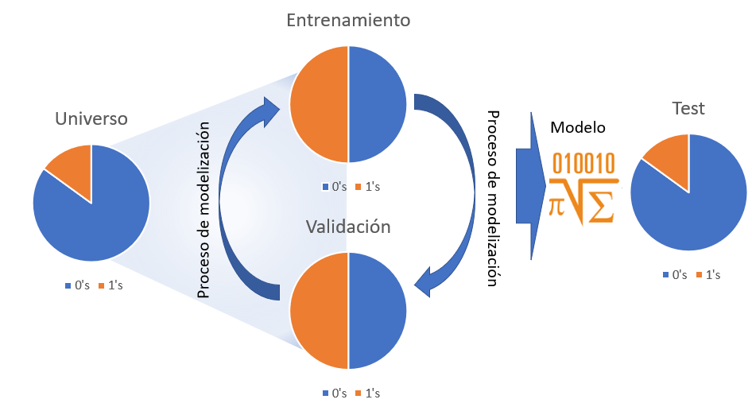

# Modelización estadística. Conociendo los datos {#modelizacion-estadistica}

## Establecer un método para la modelización estadística

En el capítulo 3 del ensayo se hacía mención al <a href="https://www.tidyverse.org/" target=_blank>universo tidyverse</a> y las librerías de R que englobaba, además de esas librerías hay una publicación de Hadley Wickham y Garret Grolemund <a href="https://r4ds.had.co.nz/" target="_blank">R for data sience</a> donde aparece la siguiente imagen:


Esa imagen describe un método para realizar _ciencia de datos_ con R. Como en la anterior figura, este capítulo se dedicará a describir e ilustrar un método de modelización que recoge todo lo trabajado con anterioridad en el ensayo, para ello se emplea el ejemplo que ha servido de hilo conductor en otros capítulos. El ya conocido **modelo de venta cruzada en el sector asegurador**: 

>Las compañías de seguros que operan en múltiples ramos tienen en sus propios clientes potenciales a los que ofrecer seguros de otro ramo. Esta estrategia no es solo beneficiosa para ganar clientes, también es importante para fidelizar e incluso a la hora de seleccionar riesgos. Si un cliente tiene asegurados dos vehículos en la compañía es de suponer que sólo está conduciendo uno de ellos. Por estos motivos un cliente integral en una compañía de seguros aporta más valor.

A continuación se trabaja con un ejemplo de clientes de una compañía aseguradora que están en el ramo de Salud, la compañía pretende comercializar entre estos clientes su seguro de automóviles y para ello realizó una encuesta y etiquetó a aquellos clientes que estarían interesados en el seguro de automóviles. Los datos empleados para este trabajo se pueden obtener en <a href="https://www.kaggle.com/datasets/anmolkumar/health-insurance-cross-sell-prediction" target="_blank">este link</a> ya que corresponden a una competición de kaggle. Como se indica en la propia competición:

>El cliente es una compañía de seguros que ofrece seguros médicos, ahora ellos realizan un test para construir un modelo que permita predecir si los asegurados (clientes) del año pasado también estarán interesados en el seguro para vehículos provisto por la compañía.

El científico de datos tiene que tener muy claro el objetivo de su trabajo de modelización. Con los datos que provienen de las encuestas es necesario realizar un modelo que permita seleccionar y caracterizar clientes para futuras campañas comerciales. Una vez se tiene claro el objetivo puede dar comienzo el trabajo de modelización. 

## Un método de modelización estadística

Cada profesional ha de diseñar su propio método o seguir el que se utilice en el equipo con el que trabaje, en este ensayo se muestra un método probado en múltiples proyectos de ciencia de datos y que resume todo lo trabajado en capítulos anteriores:


Selección de datos, aproximación a los datos y análisis gráficos descriptivos para comenzar a describir el problema. El estudio de las principales características de la variable dependiente, creación de los factores que han de describirla y finalmente la modelización estadística. 

## Conocimiento de los datos

Antes de empezar es necesario disponer del data frame de trabajo. Proceso ya conocido.

```{r message=FALSE, warning=FALSE}
library(tidyverse)
library(DT)

train <- read.csv("./data/train.csv")
datatable(head(train,5))
```

Este paso es fundamental y puede ser uno de los más complicados, **disponer de los datos necesarios**, no es el objetivo de este trabajo pero es necesario asegurar con los equipos técnicos y con los ingenieros de datos que la base de partida tiene la estructura necesaria para la modelización. Aunque sea a alto nivel se puede intuir que el científico de datos tiene que tener buena comunicación tanto con los equipos de tecnología como con los equipos de negocio ya que unos son el origen y otros son los usuarios finales del conocimiento extraído a los datos. Una vez se disponga de la tabla inicial puede dar comienzo el trabajo de modelización.


### Muestreo. Datos de entrenamiento, datos de validación, datos de test y prueba ciega. 

Para comprobar el correcto funcionamiento de los modelos es necesario separar los datos en distintos subconjuntos que permitan medir no sólo la capacidad predictiva del modelo, también velar que el modelo no se exceda en la complejidad de los parámetros y que éstos puedan servir sólo para el conjunto de datos de entrenamiento. En un proceso de modelización pueden participar los siguientes conjuntos de datos. 



- Conjunto de datos de partida o universo. Es el conjunto inicial con datos no necesariamente depurados pero con la estructura e información necesaria para realizar un modelo, en el caso que ocupa se tratan de registros a nivel de cliente sobre los que se desea realizar una clasificación binomial que determine que clientes están interesados en el seguro de automóviles.   

- Conjunto de datos de entrenamiento. Son los datos que se van a emplear para modelizar, como aparece en la figura anterior en ocasiones se _balanceará_ la muestra para incrementar el número de 1's en los datos de forma que el modelo sea capaz de encontrar segmentos e indicios que permitan separar el azar de lo estadísticamente explicable. No hay un porcentaje mínimo de 1's que indiquen la necesidad de balancear la muestra pero porcentajes por debajo del 5% pueden suponer un problema para una regresión logística (por ejemplo). 

> Si un conjunto de datos tiene un 3% de 1s, de casos positivos, el modelo puede tender a etiquetar todo 0s ya que acertará en un 97% de las ocasiones y no se consideraría un mal modelo aunque no sirva para nada. 

- Conjunto de datos de validación. Para evitar el _overfitting_ o la _sobreparametrización_ se separa un conjunto de datos con las mismas características que el conjunto de datos de entrenamiento y se comprueba si el modelo está aprendiendo sólo de los datos de entrenamiento. Hay técnicas estadísticas que no adolecen de esta problemática pero es buena práctica validar el modelo.

- Conjunto de datos de test. Es un conjunto de datos que tiene exactamente las mismas características que el conjunto de datos de partida, se deshacen los posibles balanceos y tiene las mismas proporciones de 1's que el universo. Sobre él se estudiará el comportamiento del modelo que finalmente seleccione el analista. En el caso de no realizar balanceo en la muestra se puede prescindir del conjunto de datos de validación y que los datos de test directamente hagan el rol de validación y test. 

- Prueba ciega. No aparece en la figura, no todos los científicos de datos emplean esta prueba. Se trata de un conjunto de datos que no ha participado en ninguna parte del proceso de modelización pero que supondrá la prueba final para el modelo. Es habitual cuando se trabaja con "cosechas" de datos, conjuntos de datos particionados por periodos temporales, habitualmente meses, donde el último mes disponible puede hacer este rol. De este modo se puede medir con los datos más recientes si el modelo cumple su cometido. Es un buen método para medir la capacidad predictiva del modelo en los equipos de negocio. 

Las proporciones de observaciones para cada uno de los conjuntos de datos la marcará el propio científico de datos. En el ejemplo de trabajo no se dispone de prueba ciega aunque revisando la competición de Kaggle se puede identificar un conjunto de datos que realice ese rol. Se dispone del data frame de partida, _train_, que se va a dividir en el conjunto de datos de entrenamiento y de test, se prescinde el uso de validación ya que no se realizará un balanceo de la muestra puesto que se tiene un % de unos por encima del 10%.

```{r}
sum(train$Response)/nrow(train)
```


Se comienza inicialmente con el proceso de muestreo ya que es recomendable emplear menos observaciones en las fases descriptivas porque requieren un alto tiempo de computación y de interacción con los datos. En esta primera fase se divide _train_ al 50%.

```{r}
set.seed(45)
indices <- sample(seq(1:nrow(train)) , round(nrow(train) * 0.50))

entrenamiento <- train[indices,]; nrow(entrenamiento)/nrow(train)
test <- train[-indices,]; nrow(test)/nrow(train)
```

Se ha dividido _train_ en _entrenamiento_ y _test_ al 50% y sobre _entrenamiento_ dan comienzo las primeras aproximaciones a los datos. 

### Aproximación inicial a los datos 

El primer paso es determinar el rol que juega cada variable dentro del conjunto de datos para definir los primeros análisis. 

- `Id` es el campo identificativo del cliente, no debe participar en el proceso de modelización
- `Response` es la variable respuesta, será el target
- Resto de variables. Variables input, variables de entrada que deben describir el comportamiento de `Response`

La proporción de `Response` en _entrenamiento_ es la siguiente:

```{r}
entrenamiento %>% group_by(Response) %>% 
  summarise(pct_interesados = round(sum(Response)/nrow(entrenamiento),4))
```

A partir de este momento el trabajo del científico de datos será identificar características en las variables input que hagan variar en mayor medida ese `r round(sum(entrenamiento$Response)*100/nrow(entrenamiento),1)`%  de clientes interesados y reunir todas esas características en una estructura algebraica que se denomina modelo. 

Como se indicó en capítulos anteriores todo debe dar comienzo con el análisis EDA y por ello es necesario retomar el uso de de la librería `DataExplorer` y, sin lanzar el análisis EDA al completo, obtener una serie de gráficos ya conocidos.

```{r message=FALSE, warning=FALSE}
library(DataExplorer)
introduce(entrenamiento)
plot_missing(entrenamiento)
plot_histogram(entrenamiento, ncol = 3)
```

Comprobado que no hay valores perdidos se empieza graficando los histogramas de las variables cuantitativas presentes en los datos y aparecen problemas conocidos. Tanto el campo `Id` como `Vintage` parecen ser completamente aleatorios por la forma de su histograma, es normal con un campo identificativo pero es algo a tener en cuenta con la variable que define la antigüedad del cliente. Por otro lado, `Policy_Sales_Channel` y `Region_Code` son variables categóricas y aparecen como variables numéricas. Este tipo de situaciones sólo se identifican si se conocen los datos y de nuevo se reitera la necesidad de que el científico de datos se involucre tanto con el problema de negocio y como con los equipos técnicos encargados de elaborar los datos, no se pueden hacer medias de sexo ni contabilizar saldos en fondos de inversión, cada variable tiene su propio análisis como se ha reiterado a lo largo de todo el ensayo. 

```{r}
entrenamiento <- entrenamiento %>% mutate(
  Policy_Sales_Channel = as.factor(Policy_Sales_Channel),
  Region_Code = as.factor(Region_Code))
```

Ahora se está en disposición de estudiar los factores disponibles en el conjunto de datos. 

```{r}
plot_bar(entrenamiento, ncol=2)
```

Directamente se obtiene un mensaje que identifica otro problema, precisamente las variables que se han transformado en factores tienen un gran número de niveles, será necesario realizar un trabajo de agrupación de niveles que se hará con posterioridad. Otro de los problemas que apareció en capítulos anteriores se encuentra en la variable `Driving License` que sólo toma el valor 1, este hecho tiene todo el sentido, ya que solo se debe ofrecer un seguro de automóviles a aquel cliente que dispone de licencia de conducción. Esta variable será eliminada del proceso porque tiene una justificación desde el punto de vista de negocio. 

```{r}
entrenamiento <- entrenamiento %>% select(-Driving_License)
```

### Clasificación de factores

En las aproximaciones iniciales se han realizado las principales depuraciones de datos, pero no es un proceso acabado, las siguientes iteraciones en el proceso de modelización continuarán con esa labor de depuración. Sin embargo, a partir de ahora el científico de datos ya introduce "su problema" en los análisis. Cuando se tiene una variable target y una variable que ayude a describir ese target se está realizando análisis bivariable como se trabajó en el capítulo 11. En aquel momento se planteó un análisis descriptivo de esta forma:

```{r}
bivariable <- function(df, target, varib, ajuste=1){
  
target = as.symbol(target)
fr_analisis = as.symbol(varib)

g <- df %>%
   group_by(factor_analisis = as.factor(!!fr_analisis)) %>%
   summarise(pct_clientes = round(n()*100/nrow(df),1),
           pct_interesados = round(sum(!!target)*100/n(),1), .groups='drop') %>% 
   ggplot(aes(x=factor_analisis)) +
   geom_line(aes(y=pct_interesados * ajuste), group=1, color="red") +
   geom_col(aes(y=pct_clientes),fill="yellow",alpha=0.5)  +
   geom_text(size=3, aes(y=pct_interesados * ajuste, label = paste(pct_interesados,' %')), color="red") +
   scale_y_continuous(sec.axis = sec_axis(~./ajuste, name="% interesados"), name='% clientes') +
   theme_light()

g + labs(title = paste0("Análisis de la variable ",varib))
}
 
```

Es necesario realizar este análisis para cada una de las variables cualitativas presentes en el proceso de modelización. 

```{r message=FALSE, warning=FALSE}
library(gridExtra)

p1 <- bivariable(entrenamiento, 'Response', 'Gender', 0.5)
p2 <- bivariable(entrenamiento, 'Response', 'Age', 0.5)
p3 <- bivariable(entrenamiento, 'Response', 'Region_Code', 0.5)
p4 <- bivariable(entrenamiento, 'Response', 'Previously_Insured', 0.5)
p5 <- bivariable(entrenamiento, 'Response', 'Vehicle_Age', 0.5)
p6 <- bivariable(entrenamiento, 'Response', 'Vehicle_Damage', 0.5)
p7 <- bivariable(entrenamiento, 'Response', 'Policy_Sales_Channel', 0.5)

grid.arrange(p1,p2,p3,p4,p5,p6,p7, ncol=2)
```

Situaciones ya conocidas. La variable `Age` parece discriminar bien pero es necesario trabajar sobre ella. La variable `Region_Code` es inmanejable al igual que `Policy_Sales_Channel` debido al alto número de factores. Además, tanto `Previosly_Insured` como `Vehicle_Damage` discriminan _demasiado bien_. La variable `Vehicle Age` es un factor con orden y en el gráfico éste no se está siguiendo. Por otro lado, quedan por analizar las variables cuantitativas. Es decir, el análisis bivariable está volviendo a la necesidad de depurar los datos. 

El primer paso que ha de dar el científico de datos es el que requiera introducir o eliminar observaciones, es necesario determinar que se hace con las variables `Previosly_Insured` y `Vehicle_Damage`, ¿se eliminan esos clientes que no muestran ningún tipo de interés en el seguro de Automóviles? Es una decisión que hay que consensuar con los equipos de negocio y en realidad ya está arrojando información acerca del uso que se le puede dar a la encuesta planteada, ¿cómo es posible que no tengan interés un cliente que ya ha estado asegurado? 

En este caso se opta por eliminar aquellos segmentos de clientes que no tienen interés en el producto de automóviles aunque se pierda capacidad a la hora de discriminar clientes. Directamente nunca debería realizarse un contacto comercial con aquellos clientes que ya han estado asegurados o que no tienen daños. 

```{r}
entrenamiento <- entrenamiento %>% filter(Previously_Insured == 0 | Vehicle_Damage == "Yes") %>% 
  select(-Previously_Insured, -Vehicle_Damage)
```

Además, se modifica el orden de la variable `Vehicle_Age`.

```{r}
entrenamiento <- entrenamiento %>% mutate(fr_antiguedad_vehiculo=case_when(
  Vehicle_Age=='< 1 Year' ~ '1. menos 1 año',
  Vehicle_Age=='1-2 Year' ~ '2. entre 1-2 años',
  TRUE ~ '3. mas 2 años'))
```

Se crea una nueva variable manteniendo la original. Como recomendación, en el momento de tener una variable trabajada es buena práctica añadir a ésta una denominación que permita identificarla, en este caso se añade el prefijo `fr_` de _factor reclasificado_. Esto significa que este factor ya está listo para formar parte del proceso de modelización. 

Se repite el análisis bivariable con los factores seleccionados. 

```{r}
entrenamiento <- entrenamiento %>% 
  rename(fr_sexo = Gender)

p1 <- bivariable(entrenamiento, 'Response', 'fr_sexo', 0.5)
p2 <- bivariable(entrenamiento, 'Response', 'Age', 0.5)
p3 <- bivariable(entrenamiento, 'Response', 'Region_Code', 0.5)
p4 <- bivariable(entrenamiento, 'Response', 'fr_antiguedad_vehiculo', 0.5)
p5 <- bivariable(entrenamiento, 'Response', 'Policy_Sales_Channel', 0.5)

grid.arrange(p1,p2,p3,p4,p5, ncol=2)
```

El siguiente paso será la **agrupación de niveles de factores** se comienza con la agrupación de los factores en estudio. Existen técnicas de agrupación de factores como el WOE (Weight Of Evidence) pero en este caso la agrupación se va a llevar a cabo en función del propio análisis bivariable dividiendo los factores en 3 niveles alto, medio y bajo interés.

```{r}
fr_zona <- entrenamiento %>%
   group_by(Region_Code) %>%
   summarise(clientes = round(n()*100/nrow(entrenamiento),1),
           pct_interesados = round(sum(Response)*100/n(),1), 
           .groups='drop') %>% 
  arrange(desc(pct_interesados))

datatable(fr_zona)
```

De nuevo se reitera la importancia de trabajar con equipos de negocio, es posible que se estén identificando comportamientos zonales interesantes. Para facilitar el trabajo se fijan los siguientes umbrales, alto interés >=20% interesados, medio interés 20-12% de interesados, bajo interés < 12% este establecimiento de umbrales se tiene que hacer mediante análisis y en consenso con los equipos usuarios de los modelos, si esta clasificación es correcta se puede emplear también para la variable `Policy_Sales_Channel`.

```{r}
fr_zona <- fr_zona %>% mutate(fr_zona = case_when(
  pct_interesados<=12 ~ '3. bajo interés',
  pct_interesados<=20 ~ '2. medio interés',
  TRUE ~ '1. alto interés'))

fr_canal <- entrenamiento %>%
   group_by(Policy_Sales_Channel) %>%
   summarise(clientes = round(n()*100/nrow(entrenamiento),1),
           pct_interesados = round(sum(Response)*100/n(),1), .groups='drop') %>% 
  arrange(desc(pct_interesados)) %>% 
  mutate(fr_canal = case_when(
  pct_interesados<=12 ~ '3. bajo interés',
  pct_interesados<=20 ~ '2. medio interés',
  TRUE ~ '1. alto interés'))

entrenamiento <- entrenamiento %>% left_join(select(fr_zona, Region_Code, fr_zona)) %>% 
  left_join(select(fr_canal, Policy_Sales_Channel, fr_canal))
```

Se crean dos conjuntos de datos con la agrupación del % de clientes interesados y se cruzan con el conjunto de datos de entrenamiento. Ahora se disponen de 2 factores reclasificados que deben estudiarse de forma bivariable. 

```{r}
p1 <- bivariable(entrenamiento, 'Response', 'fr_zona', 0.5)
p2 <- bivariable(entrenamiento, 'Response', 'fr_canal', 0.5)

grid.arrange(p1, p2)
```

Es necesario rehacer los factores creados, aparecen niveles con pocos clientes, están descompensados. Hay que iterar con la agrupación de esos factores. No hay una regla para decidir el % de observaciones o de exposición en un nivel, pero por debajo del 5% es necesario plantearse la agrupación de un nivel de un factor. 

```{r}
fr_zona <- fr_zona %>% mutate(fr_zona = case_when(
  pct_interesados<=15 ~ '3. bajo interés',
  pct_interesados<=20 ~ '2. medio interés',
  TRUE ~ '1. alto interés'))

fr_canal <- entrenamiento %>%
   group_by(Policy_Sales_Channel) %>%
   summarise(clientes = round(n()*100/nrow(entrenamiento),1),
           pct_interesados = round(sum(Response)*100/n(),1), .groups='drop') %>% 
  arrange(desc(pct_interesados)) %>% 
  mutate(fr_canal = case_when(
  pct_interesados<=15 ~ '3. bajo interés',
  pct_interesados<=27 ~ '2. medio interés',
  TRUE ~ '1. alto interés'))

entrenamiento <- entrenamiento %>% select(-fr_zona, -fr_canal) %>% 
  left_join(select(fr_zona, Region_Code, fr_zona)) %>% 
  left_join(select(fr_canal, Policy_Sales_Channel, fr_canal))

p1 <- bivariable(entrenamiento, 'Response', 'fr_zona', 1)
p2 <- bivariable(entrenamiento, 'Response', 'fr_canal', 1)

grid.arrange(p1, p2)
```

Este proceso se puede alargar pero tiene importancia debido a que genera factores y **conocimiento de negocio** sobre el problema para el analista. Por ejemplo, se aprecia que hay canales donde no se muestra ningún interés, la media de la proporción está por debajo del 9% y en intereses medios y altos apenas ofrece poder discriminatorio esta variable. Por el momento se mantienen estas agrupaciones. 

Una de las variables que están ofreciendo una buena capacidad de discriminar el interés de los clientes por el producto de automóviles es `Age`, sin embargo, también interesa agruparla. En el capítulo dedicado al muestreo y la inferencia se vio este gráfico.


Los intervalos de confianza son buenos aliados a la hora de agrupar factores porque están estableciendo un rango entre el que la media, la proporción, aparecerá un 95% de las veces. Se mejora la función bivariable con ese código. 

```{r}
bivariable <- function(df, target, varib, ajuste=1){
  
target = as.symbol(target)
fr_analisis = as.symbol(varib)

g <- df %>%
      group_by(factor_analisis = as.factor(!!fr_analisis)) %>%
   summarise(pct_clientes = round(n()*100/nrow(df),1),
           pct_interesados = round(sum(!!target)*100/n(),1),
           media_interesados = round(mean(!!target),3), 
           z = -qnorm(0.025,0,1),
           desviacion = sd(!!target),
           n_grupo = n(),
           .groups='drop') %>% 
  filter(!is.na(desviacion)) %>% 
  mutate(error_estimacion = z * (desviacion/sqrt(n_grupo)),
                              lim_inf=media_interesados - error_estimacion,
                              lim_sup=media_interesados + error_estimacion,
         lim_inf = ifelse(lim_inf<0, 0, lim_inf)) %>% 
   ggplot(aes(x=factor_analisis)) +
   geom_line(aes(y=pct_interesados * ajuste), group=1, color="red") +
   geom_col(aes(y=pct_clientes),fill="yellow",alpha=0.5)  +
   geom_text(size=3, aes(y=pct_interesados * ajuste, label = paste(pct_interesados,' %')), color="red") +
   scale_y_continuous(sec.axis = sec_axis(~./ajuste, name="% interesados"), name='% clientes') +
   geom_ribbon(aes(x=as.numeric(factor_analisis), ymin=lim_inf*ajuste*100, ymax=lim_sup*ajuste*100), linetype=2, alpha=0.5) + 
   theme_light()

g + labs(title = paste0("Análisis de la variable ",varib))
}

bivariable(entrenamiento, 'Response', 'Age', 0.5)
```

> Los códigos de R se van sofisticando y no se estudia su estructura Todo ese código se ha visto con anterioridad. Se insiste en la importancia que tiene para el científico de datos construirse sus funciones y sus herramientas para los análisis exploratorios iniciales.  

Se aprecia como la inferencia estadística hace más efectivo el trabajo del científico de datos. Se pueden crear agrupaciones en base a ese intervalo de confianza, en este caso y para simplificar, se opta por agrupar las edades superiores a 60 años.

```{r}
entrenamiento <- entrenamiento %>% mutate(fr_edad = ifelse(Age>=60,60,Age)) 
bivariable(entrenamiento, 'Response', 'fr_edad', 0.8)
```

Esta agrupación es insuficiente porque se incumple la proposición de disponer al menos del 5% de observaciones en muchos niveles del factor. Es necesario mejorar la reclasificación. 

```{r}
entrenamiento <- entrenamiento %>% mutate(Age=as.numeric(Age),
  fr_edad = case_when(
 Age >18 & Age <=22 ~ '1. Menores 20 años',
 Age >= 23 & Age <=24 ~ '2. Entre 22 y 23 años',
 Age >= 25 & Age <=30 ~ '3. Entre 25 y 30 años',
 Age >= 31 & Age <=35 ~ '4. Entre 31 y 35 años',
 Age >= 36 & Age <=45 ~ '5. Entre 36 y 45 años',
 Age >= 46 & Age <=60 ~ '6. Entre 46 y 60 años',
 Age > 60  ~ '7. Mayores 60 años'))
  
bivariable(entrenamiento, 'Response', 'fr_edad', 0.8)
```

Todos los factores están trabajados, pero es necesario **discretizar las variables cuantitativas** para que puedan formar parte del modelo. Al igual que sucede con los factores existen métodos automáticos como el WOE que permiten realizar esta agrupación, pero se pretende que el científico de datos emplee la estadística aprendida para mejorar sus análisis y el conocimiento de los datos. En el capítulo 11 dedicado al análisis bivariable se planteó un método para agrupar variables cuantitativas trabajando con 10 grupos con el mismo número de clientes. Recuperando ese código:

```{r}
# Se divide la variable en 10 tramos con el mismo número de observaciones
grupos = 10

entrenamiento <- entrenamiento %>% arrange(Annual_Premium) %>% 
mutate(fr_prima = as.factor(ceiling((row_number()/n()) * grupos)))

bivariable(entrenamiento, 'Response', 'fr_prima', 0.8)
```

Una simple agrupación de una variable cuantitativa está describiendo la situación, primas bajas muestran menos interés que las primas altas. Además estos niveles son susceptibles de ser agrupados. 

```{r}
datatable(
entrenamiento %>% group_by(fr_prima) %>% 
  summarise(minimo = min(Annual_Premium),
            maximo = max(Annual_Premium)))
```

Aparece un valor modal en la prima en 2630 €, sería necesario comunicar de nuevo con los equipos de negocio para que nos comentaran que está sucediendo con ese rango de prima. Con el gráfico anterior y esta tabla se puede plantear una agrupación de este modo: 

```{r}
entrenamiento <- entrenamiento %>% mutate(fr_prima = case_when(
  Annual_Premium <= 3000 ~ '1. Menor de 3000 €',
  Annual_Premium <= 40000 ~ '2. Entre 3000 y 40000 €',
  TRUE ~ '3. Más de 40000 €'))

bivariable(entrenamiento, 'Response', 'fr_prima', 0.8)
```

Tampoco se aprecia un poder muy discriminatorio para primas superiores a 3000 €. Se repite el proceso con la variable `Vintage`. 

```{r}
grupos = 10

entrenamiento <- entrenamiento %>% arrange(Vintage) %>% 
mutate(fr_antiguedad = as.factor(ceiling((row_number()/n()) * grupos)))

bivariable(entrenamiento, 'Response', 'fr_antiguedad', 0.8)
```

Con esta variable el target apenas tiene variación, permanece plano en toda la agrupación de deciles. Algo que se podía intuir con los histogramas previos de la variable ya que la distribución era cuadrada, forma típica de variables aleatorias. Debido a su (aparente) escasa capacidad predictiva no se trabaja más con ella pero participará en el proceso de modelización de modo que sea el modelo el encargado de aceptar o rechazar algunos de los niveles del factor. 

## El código de reclasificación de factores

Antes de continuar y analizar las interacciones es necesario recopilar y ordenar todo el código R necesario para preparar los datos de cara a la modelización. Este código de reclasificación de factores debe ser parte del modelo y de la **documentación que acompaña al modelo** al igual que los gráficos descriptivos y bivariables. Este paso simplemente recopila los análisis previos y las clasificaciones finales elegidas para cada factor. Además ese código se empleará en los datos de origen ya que es posible replicar el proceso de muestreo.

El primer paso consiste en filtrar por aquellas variables que no aportan al modelo o cuya aportación pueden empeorar el objetivo del proceso de modelización. 

```{r}
# Se mantiene el conjunto de datos inicial
train2 <- train %>% 
  filter(Previously_Insured == 0 | Vehicle_Damage == "Yes") 
```

No se sobrescribe el conjunto de datos de partida, se crea una réplica por si fuera necesario iterar de nuevo con los datos. Una vez filtrados los datos se seleccionan los códigos empleados para la reclasificación.

```{r}

train2 <- train2 %>% mutate(
  fr_antiguedad_vehiculo=case_when(
  Vehicle_Age=='< 1 Year' ~ '1. menos 1 año',
  Vehicle_Age=='1-2 Year' ~ '2. entre 1-2 años',
  TRUE ~ '3. mas 2 años'),
  fr_sexo = Gender)

# Agrupación de zonas
fr_zona <- train2 %>%
   group_by(Region_Code) %>%
   summarise(clientes = round(n()*100/nrow(train2),1),
           pct_interesados = round(sum(Response)*100/n(),1), 
           .groups='drop') %>% 
  arrange(desc(pct_interesados)) %>% mutate(fr_zona = case_when(
  pct_interesados<=12 ~ '3. bajo interés',
  pct_interesados<=20 ~ '2. medio interés',
  TRUE ~ '1. alto interés'))

fr_canal <- train2 %>%
   group_by(Policy_Sales_Channel) %>%
   summarise(clientes = round(n()*100/nrow(train2),1),
           pct_interesados = round(sum(Response)*100/n(),1), .groups='drop') %>% 
  arrange(desc(pct_interesados)) %>% 
  mutate(fr_canal = case_when(
  pct_interesados<=12 ~ '3. bajo interés',
  pct_interesados<=20 ~ '2. medio interés',
  TRUE ~ '1. alto interés'))

train2 <- train2 %>% left_join(select(fr_zona, Region_Code, fr_zona)) %>% 
  left_join(select(fr_canal, Policy_Sales_Channel, fr_canal))

# Agrupación de factores
train2 <- train2 %>% 
  mutate(
  Age=as.numeric(Age),
  fr_edad = case_when(
  Age >18 & Age <=22 ~ '1. Menores 20 años',
  Age >= 23 & Age <=24 ~ '2. Entre 22 y 23 años',
  Age >= 25 & Age <=30 ~ '3. Entre 25 y 30 años',
  Age >= 31 & Age <=35 ~ '4. Entre 31 y 35 años',
  Age >= 36 & Age <=45 ~ '5. Entre 36 y 45 años',
  Age >= 46 & Age <=60 ~ '6. Entre 46 y 60 años',
  Age > 60  ~ '7. Mayores 60 años'),
  
  fr_prima = case_when(
  Annual_Premium <= 3000 ~ '1. Menor de 3000 €',
  Annual_Premium <= 40000 ~ '2. Entre 3000 y 40000 €',
  TRUE ~ '3. Más de 40000 €'))

grupos = 10
train2 <- train2 %>% arrange(Vintage) %>% 
mutate(fr_antiguedad = as.factor(ceiling((row_number()/n()) * grupos)))

datatable(head(train2))

```

Se mantienen todas las variables en bruto, las iniciales, por si fuera necesario volver atrás y realizar una nueva agrupación o reclasificación. Siempre es necesario ejecutar el análisis bivariable para que forme parte de la documentación de todo el proceso. 

```{r}
predictoras <- names(train2) 
predictoras <- predictoras[substr(predictoras,1,3)=="fr_"]

lista_graficos <- list()

for (i in seq(1:length(predictoras))){
  lista_graficos[[i]] <- bivariable(train2, 'Response', predictoras[i], 0.8)
}

```

Otro de los motivos por los que es interesante identificar de algún modo los factores reclasificados que formarán parte del modelo es la posibilidad de automatizar código como ilustra el ejemplo anterior ya que no ha sido necesario escribir el nombre de la variable, además será un código que el científico de datos podrá reutilizar.

Se ha creado una lista con los gráficos que podrán ser obtenidos mediante `grid.arrange` del siguiente modo. 

```{r}
grid.arrange(grobs = lista_graficos, ncol=2)
```

Insistiendo, todos estos resultados deben acompañar a la documentación que el científico de datos genere cuando realice el modelo. Cuanto más automatizado esté el proceso de generación de análisis previos, gráficos y documentación menos tiempo se dedicará a esta relevante tarea, cuanto más documentado esté el proceso más sencillo será de replicar. 

## Análisis de interacciones

El último paso de la fase previa sobre el conocimiento de los datos será el análisis de interacciones. Definidos los factores que van a formar parte del modelo es posible trabajar sobre ellos para encontrar posibles interacciones entre ellos. Las interacciones serán más fáciles de analizar si los factores presentes tienen un número bajo de niveles, de nuevo se recomienda que el científico de datos disponga de herramientas y análisis gráficos para estudiar esta situación. Un posible análisis gráfico puede ser. 

```{r}
train2 %>% group_by(fr_antiguedad_vehiculo, fr_sexo) %>% 
  summarise(pct_clientes = round(n()*100/nrow(train2),1),
            pct_interesados = round(sum(Response)*100/n(),1), 
            .groups='drop') %>%
ggplot(aes(x = fr_antiguedad_vehiculo, y = pct_interesados, group=fr_sexo, color = fr_sexo)) +
  geom_line() + geom_point()
```

Sobre esta propuesta se crea una función. 

```{r}
interacciones <- function(df, target, varib1, varib2){
  
target = as.symbol(target)
fr_analisis1 = as.symbol(varib1)
fr_analisis2 = as.symbol(varib2)

g <- df %>%
   group_by(!!fr_analisis1, !!fr_analisis2) %>%
   summarise(pct_interesados = round(sum(!!target)*100/n(),1), 
             .groups='drop') %>% 
   ggplot(aes(x = !!fr_analisis1, y = pct_interesados, group=!!fr_analisis2, color = !!fr_analisis2)) +
   geom_line() + geom_point() +
   theme_light()

g + labs(title = paste0("Interacción de ",varib1," con ",varib2))
}

interacciones(train2, 'Response', 'fr_antiguedad_vehiculo', 'fr_sexo')
interacciones(train2, 'Response', 'fr_zona', 'fr_canal')
```

Se obtienen 2 ejemplos, el cruce entre antigüedad del vehículo y sexo y el cruce entre canal y zona. En el primero parece existir cierta interacción entre los factores y en el segundo las tres líneas son "paralelas". Este proceso es arduo y requiere reprocesar los factores continuamente, pero proporcionará al científico de datos variables y conocimiento del problema a analizar. En este caso no se profundiza en ello para no alargar demasiado el capítulo. 

